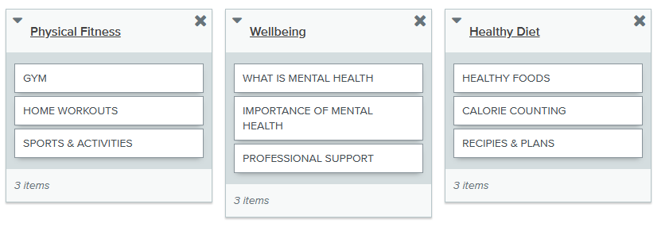
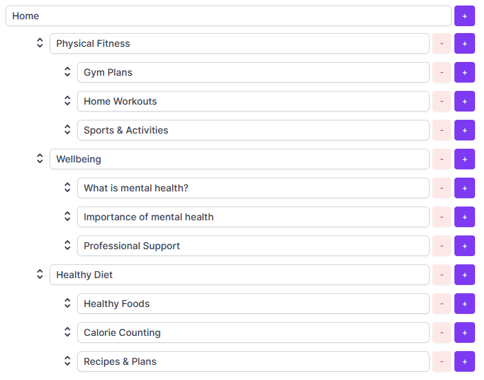

# Information Architecture Report

**Word count** 800 words maximum

## Card sort

### Introduction

Card sorting is a method used to help design and analyse the information architecture of a site. In numerous card sorting sessions, we asked participants to organise our topics into categories that make sense to them and help us to design the architecture for our site.

Please find listed below the categories we shared and the results of the most popular card sort.

### List of the card elements

- Gym workouts 
- Recipes and meal plans
- Home workouts 
- What is mental health?
- Importance of mental health
- Healthy foods
- Sporting activities
- Professional support 
- Calorie counting

### Cart sort results

---

## Tree testing

### Introduction

No that we had an architecture ywe liked, we tested it out with a tree testing exercise, initially on paper before using the Optimal Workshop Treejack (online).

### Illustration of the architecture tested

### Tree testing results

Given that a website's architecture is incredibly important for both user experience and SEO, we believe the tree testing exercise confirmed our choice of our website structuring strategy, with the aims of improving dwell time and encouraging our users to consume more of your content and explore all aspects of the site - rather than just reading one section.

---
