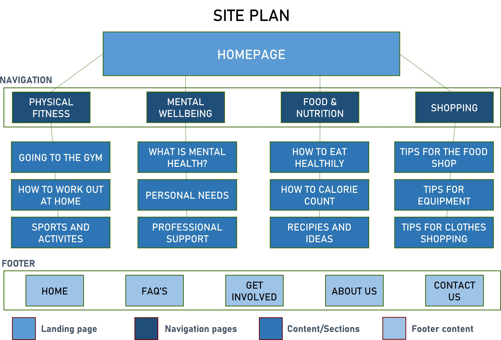

# Site Plan

Add your initial site plan for SP2, and any further revisions for SP5. Include commentary.

## Original Site Plan

### Commentary
You have established this architecture following the card sort and tree testing. Explain the architecture that we now see.

After completing a card sorting activity to brainstorm with the team, and utilising the layout elements and style provided by the practise of tree testing, we have been able to establish the relationships between the categories we will have on our website. All content on the site map is labelled with the titles/sub-titles, or the names that the user will see, of the interactive buttons we will use. The architecture of the website has the homepage/landing page at the top of the diagram as this is accessed through the primary link to the website. Followed by the navigation pannel, 3 sub-headings/sub-pages for content which follows from the pre-determined internal links (located in the navigation), taking you to one of three subpages within our site, and finally the footer.

---

>We would expect at least one further iteration, but don't adjust them for the sake of it. Your final version must reflect the architecture of the site (The Guide) that you submit at SP5.

## Site Plan v2

### Commentary
Detail your revisions. If it helps, highlight the changes on the site plan itself.

In this revision we have added an 'about us' section at the naviagtion pannel, upon clicking this the user will be taken to the sub-page of 'who we are' where we will detail who the creators of the website are and how the inspiration for our website became a reality, we will also detail how our group is passionate about the topic. we have also added a shopping tab to our footer, closer to the time when we will decide which external website we will link off to to advicse users where they can purchase gym and fitness related equipment from.

---

## Site Plan v3

### Commentary
Detail your revisions. If it helps, highlight the changes on the site plan itself.

Our revisions for our final site plan include confirmation of the number of webpages and what they will be titled, as well as concluding what our content features and will specifically explore. We have also amended the navigation pannel and footer pannel to ensure the most important content and links sit at the top of our page. For example, we have moved the shopping tab to the end of our navigation in the hopes the user will go there after looking through our how to webpages beforehand. We have alo amended the wording to make our website more general yet factual, to ensure we keep with a friendly yet informative website and webpages. The overview of the content and structure has now been decided as this stage.

