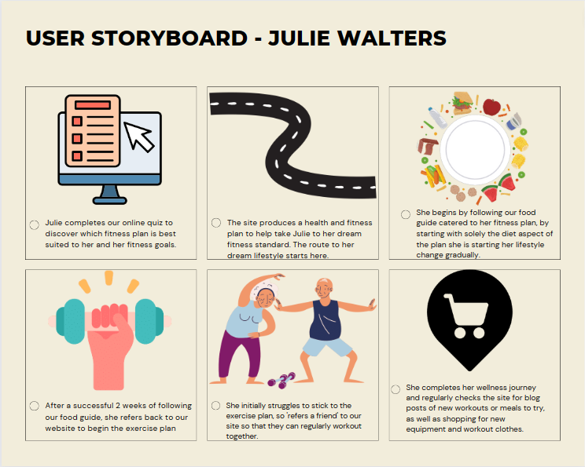
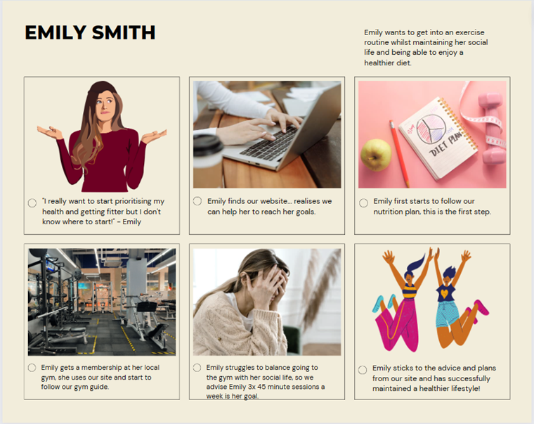

# Storyboards

## Storyboard One

### Name of persona in this storyboard
Provide a description and explain how this storyboard relates to the persona and your user research.

---

## Storyboard Two

### Name of persona in this storyboard - Emily Smith
Provide a description and explain how this storyboard relates to the persona and your user research.
This storyboard relates to the persona as it outlines the path Emily (user) will take and what has led her to our website and why she wants to use it. It's clear Emily was struggling and needed advice and guidance, further expanding on our research, this is key for Emilys age group as stability is key. The storyboard demonstrates how Emily starts her journey and how it's maintained through using our site. 

---

## Storyboard Three

### Name of persona in this storyboard - Bob Arclid

This story board directly aligns with the persona as Bob is an individual in search of improving his health. However, Bob lacks the time due to a busy lifestyle and therefore, has been struggling to understand where to get started with embarking on his self improvement journey, as a result, our website is ideal in terms of providing concise guidance on how to get started in this realm. 

---
