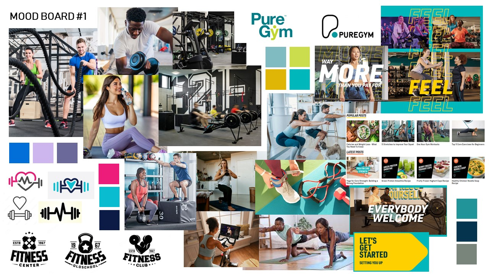
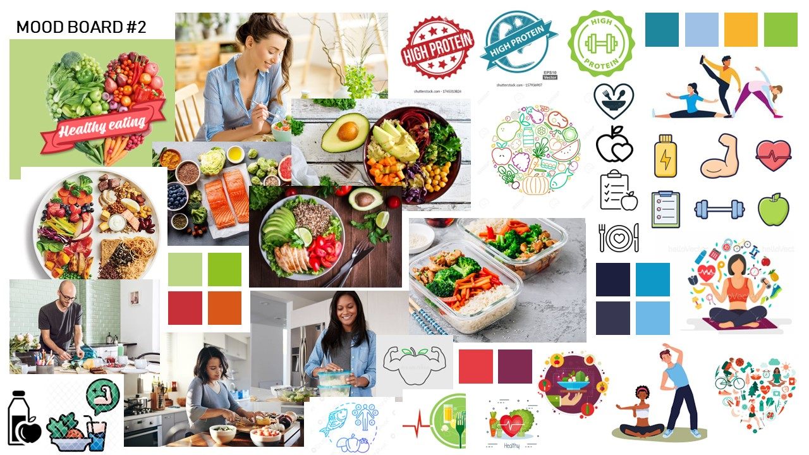

# Moodboards

Add a moodboard for each team member plus a final team moodboard.

*Tutors will download the image to view the full size persona*.

<!-- edit as required -->

## Moodboard One

### Name of team member: Sophie Norbury
Explain how your personal influences and inspirations for this moodboard: 
The first moodboard above begins by exploring the reality of working out in a gym, and how your physical fitness can be explored and improved by being in a building, surrounded by other people, and with all the equipment needed (if comfortable with it) to use as people like. PureGym is an example of a Gym that is very well known in the UK and a good indication of what a physcial gym looks like to the users visiting our website who may have never been to a gym before and are looking for advice. Puregym's website is a great example of a fitness company promoting their brand and using a modern look0-and-feel to engage users, colours such as bright turquoise and yellow are contrasting, however this makes the contnt and images pop and appear 3D on the screen. Puregym's website uses vertical scrolling, however the website is sectioned horiozontally allowing for clean cuts and distinctions betweeen the sections. The colours picked out have been taken as inspiration for what we could use on our wesbite, from the graphics and the types of colours used in photography. as the moodboard focuses on the them of working out and fitness, logos and graphics ahve also been pulled to act as inspiration of what is already out there for when we design our own, knowing what we can not copy from others.

---

## Moodboard Two

### Name of team member
Explain how your personal influences and inspirations for this moodboard.

---

## Moodboard Three

### Name of team member
Explain how your personal influences and inspirations for this moodboard.

---

## Moodboard Four

### Name of team member
Explain how your personal influences and inspirations for this moodboard.

---

## Moodboard Five

### Name of team member
Explain how your personal influences and inspirations for this moodboard.

---

## Team Moodboard

### Name of team member
Explain how you combined your influences and inspirations to create a group vision through this moodboard.

---
