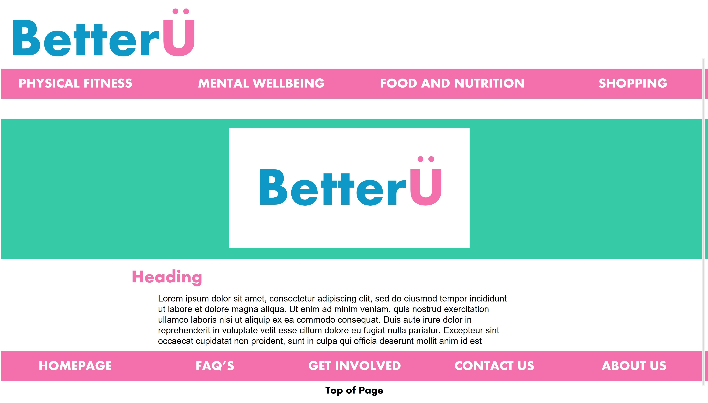

# Page mock up update

Use this area to show the updated version, incorporating changes made after user testing, of the page you originally created for SP3.

Annotate and explain the changes you have made, and tell us how these changes make the page or site easier to use, based on the data you have collected from users.

Inform us of any work that seems ‘out of scope’ - e.g. is too complex or would require a complete redesign.

From the first mockup in a previous stage of our project, there have been small changes to the design of our website and the content we will include. In the original mockup we had a very busy homepage, some stages of this have now been indicated as out of scope, the main element that has been taken out of our homepage is a 'latest news' section. We made this decision as a team due to the fact that 'latest news' does not directly corrolate with the main objective and purpose of the website, a 'how-to guide'. Adding this section would require a redesign of our homepage.

When refining our website, it was key that we ensure our communication is clear for all users. Due to the nature of our website it's important that we use the correct, yet general terminology. Our navigation pannel shows the changes of this, giving the user the most common unmbrella terms for our content pages, as some of the content can be sensitive, or goes into specific details.

