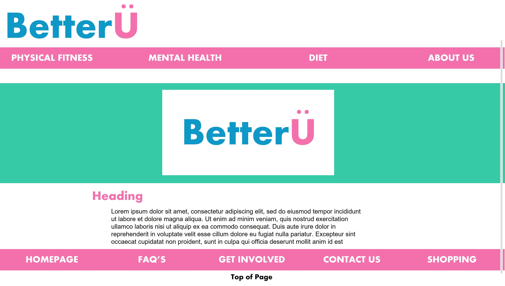

# Usability Testing Report

## Introduction

Write an introduction to your report.

1. What did you do? - We asked individuals not part of the construction of the website and outside of the university course to spend time testing our website, this includes its features, how easy the content is to digest and the overall usability of the website.
2. Why did you do it? - We ensured to test our website so that the team can see how the website acts and responds to a user who hasn't contributed to the building of the website. The website must be tested to make sure that the user experience is positive, meaning that the information we convey is taken in correctly by the reader so they won't be discouraged by a webpage that potentially may be clunky.
3. How did you do it? - We proceeded to test by requesitng the individuals to try out our website on their personal devices and following that, we conducted interviews where we looked to understand the positives from a user perspective, any issues they encountered, what could be done to improve the website and any other comments they had about the website. All of our findings from our interviews were recorded as transcripts. 

### Findings

(500 words)

Discuss the key issues that have been identified (positive and negative). This must closely relate to your observations (in your notes) and any exit surveys.

4. What did you find?

## Actions

Detail the changes your group has decided on in response to the initial testing and any subsequent test sessions.

Create an updated version of the page design and add this to the report.

The initial testing showed us that one of the main reasons our website was lacking was due to the smaller elements of a website, which could be phrased as smaller elements which enhance the fluidity of the website, things that a more experienced set of website designers may know from the beginning due to time and experience, however, as our team has taken on website design for one of the first times, we attempted to learn as much as we could in the timeframe we were given to construct our website. 

To action the outcomes of our testing, our plan is to ensure we take a double-check through our code before submission, we will check for smaller yet impactful features such as correct colours, fonts, plus text and image sizing is relevant for the area of the website it is situated. Actions we have taken from our testing sessions indicate that quality checking is vitally important. From the feedback, we will be checking the characteristics of the more visual elements of our website, ensuring that images are big enough so that they're accessible for all users. Before going live again, we will ask out team to check the links we have included, checking links means to simply 'click' the link and ensure you are taken to a working website or page. The simple action will make a big difference to the user experience.

## Results of further testing

Any further testing should be evidenced (photographs, notes and actions). Tutors will not just accept _we did some more testing_.

<!-- ## Notes

> Download -[Mini User Journey](sp4-media/mini-user-journey.pdf) forms.

Scan your completed notes as a single pdf, add to the sp4-media folder and link above. -->

## Exit survey

> Download -[Completed exit survey](sp4-media/exit-survey.pdf).

Scan your completed survey as a single pdf, add to the sp4-media folder and link above.

## Consent form(s)

> Download -[Completed consent form(s)](sp4-media/exit-survey.pdf).

Scan your completed consent form(s) as a single pdf, add to the sp4-media folder and link above.

---
